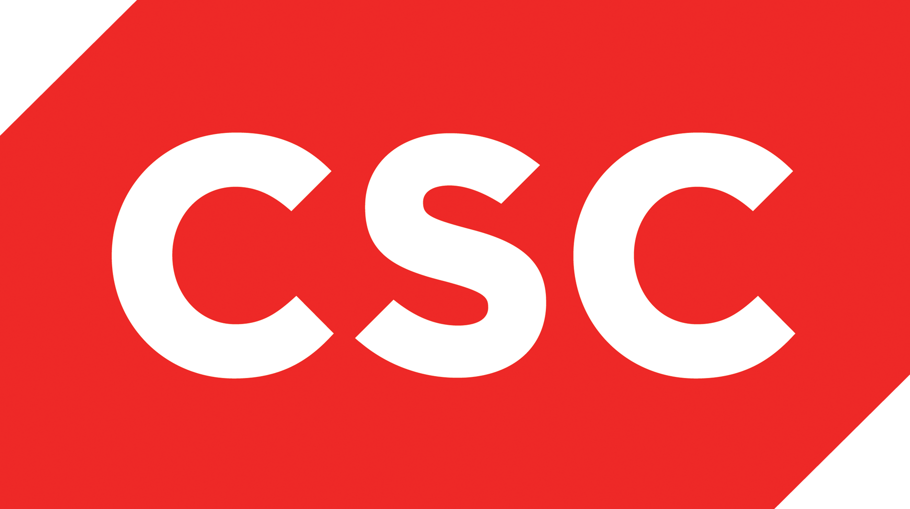

# 

# Pivotal Cloud Foundry Workshop #

#### _March 25 2016_

Hey folks,

We're delighted to announce Pivotal’s first __Cloud Foundry Workshop Day__ in Metro Detroit.
This event is hosted in partnership with CSC.

(The event is first-come, first-serve, and we expect the limited spots to disappear quickly).

## WHAT: One-Day, Hands-on Development Sprint for PCF

For one full day, the members of Pivotal's Platform Architecture team will train, pair program, and debug with a few dozen software developers – live, and face-to-face. We will help you push cloud native apps, and learn how to transform monolithic apps into cloud native apps. We’ll provide access to shared CF infrastructure.

In short, we’ll get you awesome cloud native experience.

## WHEN: March 25th

Automation Alley, 2675 Bellingham Dr, Troy, MI 48083

We will serve breakfast, lunch, coffee and snacks.

## WHO: Developers, Architects!

You will need to bring your own laptop, preconfigured with your favorite development environment.
Any one of the standard CF languages are supported. Refer to the [Prepare](http://detroitcf-workshop.cfapps.io/prereqs/) section to make sure you have the right configuration.

This is a free event and it’s open to any Pivotal/CSC customers and partners.

## HOW: Register and show up

If you’re absolutely sure you’re coming, [RSVP via this Google form](http://goo.gl/forms/IYVq2OQAH0).

A few weeks before the event, we’ll send out an “Attendee’s Guide” with some recommended reading. BUT, please note that there are only 20 seats available! If you are serious about developing software for the Cloud Native Platform ecosystem, please let us know right away.

We're looking forward to seeing you on March 25!

## About CSC, the workshop hosts  
CSC leads clients on their digital transformation journey, providing innovative next-generation technology solutions and services.  CSC helps companies to create a real-time digital manufacturing enterprise with IT-as-a-Service, modern apps, and best-in-class cybersecurity. CSC brings a unique inside-out point of view, as well as automotive-specific expertise and solutions.
